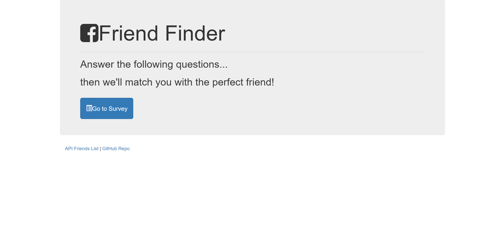
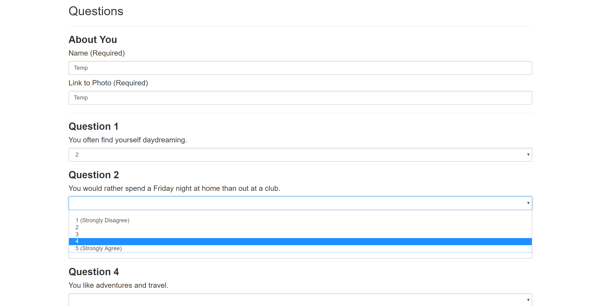
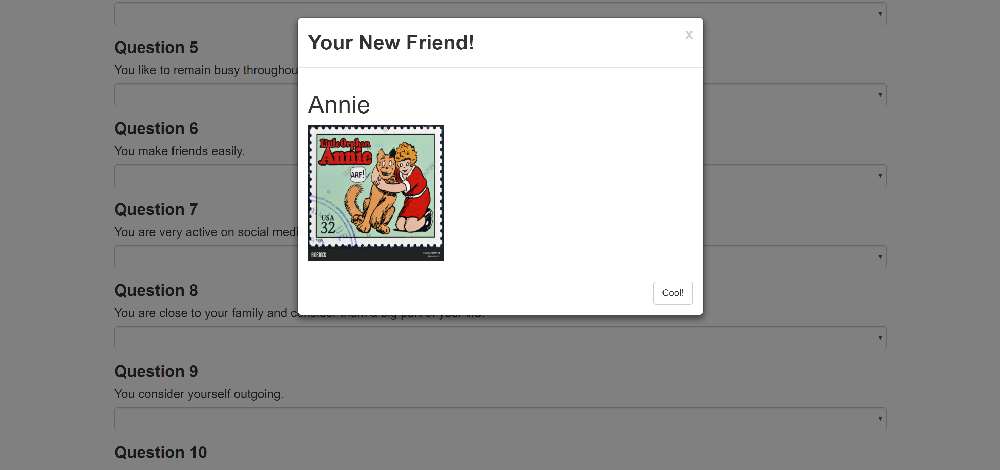

# FriendFinder
FriendFinder is a simple way to find new friends. Just answer 10 easy questions and be matched with a new companion based on your compatibility. 

## See it in action.
The homepage that appears was crafted using Bootstrap. The links in the bottom left corner will show the user the list of available friends as JSON objects and the GitHub Repo associated with the application.

When the user clicks 'Go to Survey', the following page will appear with 10 questions for the user to answer.

And finally, a modal will share which friend from the list best matches with the user based on their answers.

## Build With
JavaScript, jQuery, Node.js (with Express)

## Authors
Seton Raynor